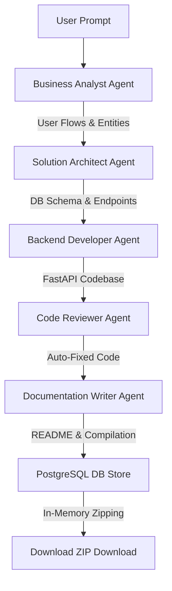

# CodeForge AI 🚀

An advanced, full-stack multi-agent developer system that automatically designs, codes, reviews, and documents fully-functional, secure backend APIs from simple natural language descriptions. 

CodeForge AI uses a structured **LangGraph orchestration pipeline** powered by state-of-the-art LLMs (via Groq) to automate the software development lifecycle, storing final projects as structured code assets in PostgreSQL.

---

## 🛠️ System Architecture

CodeForge AI features a **FastAPI backend** that drives the AI orchestration graph and a **Next.js 14 frontend** presenting a premium, glassmorphic dashboard with live, step-by-step agent reviews, timeline steppers, code explorer panels, and zip exporters.



### The 5-Agent Pipeline
1. **Business Analyst (Llama 3.1-8b)**: Outlines user stories, entity parameters, field relationships, and API requirement checklists from a single text prompt.
2. **Solution Architect (Llama 3.3-70b)**: Translates BA outlines into exact database schemas (SQLAlchemy models) and designs RESTful HTTP endpoints (`GET`, `POST`, `PUT`, `DELETE`).
3. **Backend Developer (Llama 3.3-70b)**: Writes the full application code, implementing FastAPI routes, Pydantic schemas, database connections, routers, and CORS configurations.
4. **Code Reviewer (Llama 3.3-70b)**: Audits the generated codebase, flags security issues or naming collisions, and **automatically applies fixes** directly to the code.
5. **Documentation Writer (Llama 3.1-8b)**: Analyzes the final code and outputs a production-grade `README.md` user guide.

---

## 🔑 Key Features

* **100% Database-Centric Storage**: Overhauled to be fully serverless-ready. Codebases are saved, merged, and updated as JSON structures inside PostgreSQL. No local file operations are used.
* **In-Memory ZIP Exporter**: Code files are fetched from PostgreSQL, packed into a ZIP archive entirely in-memory (`io.BytesIO`), and streamed instantly to the client.
* **Granular Ownership Control**: Access checks prevent unauthorized users from downloading or modifying generated codebase outputs.
* **Error-Loud Startup Check**: Enforces environmental configuration constraints (DATABASE_URL, JWT secrets, Groq API keys) immediately on start, failing early with explicit notices.

---

## 🚀 Getting Started

### Prerequisites
* Python 3.10+
* Node.js 18+
* PostgreSQL database

---

### Backend Setup

1. **Navigate to the backend directory**:
   ```bash
   cd backend
   ```

2. **Install dependencies**:
   ```bash
   pip install -r requirements.txt
   ```

3. **Configure Environment Variables**:
   Create a `.env` file from the example:
   ```bash
   cp .env.example .env
   ```
   Fill in the required keys:
   * `DATABASE_URL`: PostgreSQL connection string.
   * `JWT_SECRET`: Secure encryption secret.
   * `GROQ_API_KEY`: Groq API Cloud key.

4. **Apply Database Migrations**:
   ```bash
   alembic upgrade head
   ```

5. **Start the Backend**:
   ```bash
   uvicorn app.main:app --reload --port 8000
   ```

---

### Frontend Setup

1. **Navigate to the frontend directory**:
   ```bash
   cd ../frontend
   ```

2. **Install dependencies**:
   ```bash
   npm install
   ```

3. **Configure Environment Variables**:
   Create a `.env.local` or `.env` file matching `.env.example`:
   ```bash
   cp .env.example .env.local
   ```
   Set `NEXT_PUBLIC_API_URL` to point to the backend (default: `http://localhost:8000`).

4. **Start the Frontend**:
   ```bash
   npm run dev
   ```
   Open [http://localhost:3000](http://localhost:3000) in your browser.

---

## 🧪 Running Tests

Validate your local environment setups and agent mock suites:
```bash
cd backend
python -m pytest ../tests/ -p no:asyncio
```

---

## ☁️ Production Deployment

For details on deploying the application stack to cloud platforms (FastAPI backend on **Render**, Next.js frontend on **Vercel**), refer to the detailed [Deployment Guide](DEPLOYMENT.md).