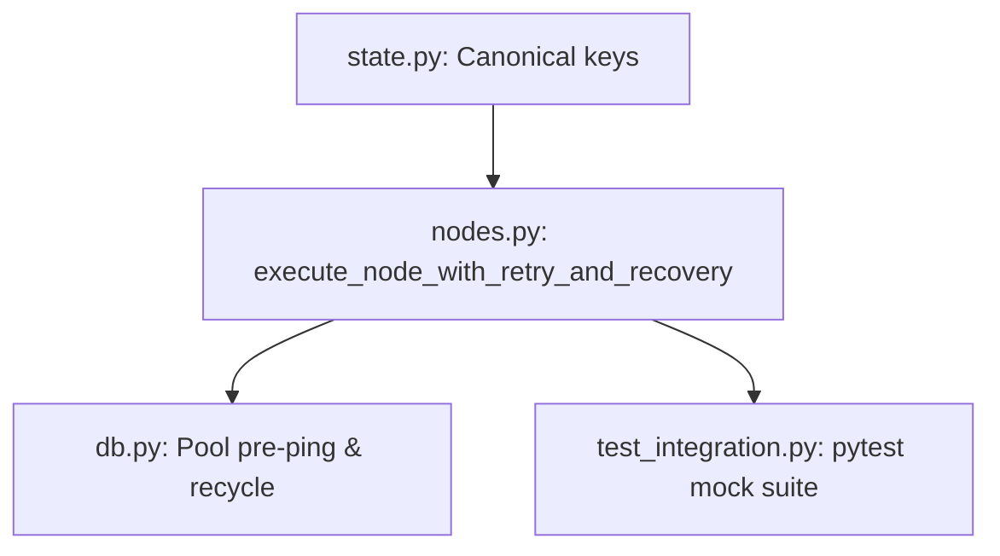

# Phase 2.1 Production Hardening — Deliverables & Architecture Report

This report documents the architectural improvements, schema corrections, database engine pool hardening, and test suites implemented during Phase 2.1 to make the orchestration engine production-ready.

---

## 1. Files Modified & Created

### Modified Files
- **[state.py](file:///d:/CodeForge%20AI/backend/orchestrator/state.py)**: Refactored `AgentState` to use a single canonical key mapping (e.g. `state["api_designer"]` instead of `state["api_plan"]`).
- **[nodes.py](file:///d:/CodeForge%20AI/backend/orchestrator/nodes.py)**: Implemented isolated deep-copy state executions inside the retry wrapper `execute_node_with_retry_and_recovery`.
- **[edges.py](file:///d:/CodeForge%20AI/backend/orchestrator/edges.py)**: Renamed `"doc_writer"` to `"documentation_writer"` in valid routing destinations.
- **[graph.py](file:///d:/CodeForge%20AI/backend/orchestrator/graph.py)**: Registered documentation writer node consistently.
- **[db.py](file:///d:/CodeForge%20AI/backend/app/db.py)**: Hardened connection pool with `pool_pre_ping=True` and `pool_recycle=1800`.
- **[agents.py](file:///d:/CodeForge%20AI/backend/app/schemas/agents.py)**: Set `response_model: Optional[str] = None` in `APIEndpoint` schema to prevent ValidationError crashes on void return endpoints.
- **[api_designer.md](file:///d:/CodeForge%20AI/backend/prompts/api_designer.md)**: Updated prompt template instructions to allow `str | null` for `response_model`.
- **[page.tsx](file:///d:/CodeForge%20AI/frontend/app/projects/%5Bid%5D/page.tsx)**: Refactored `"doc_writer"` to `"documentation_writer"`.
- **[smoke_test.py](file:///d:/CodeForge%20AI/backend/smoke_test.py)**: Replaced Unicode characters with ASCII to prevent Windows console encoding errors.

### Created Files
- **[test_integration.py](file:///d:/CodeForge%20AI/backend/tests/test_integration.py)**: New integration test suite simulating full E2E runs with patched agent classes.
- **[check_db_runs.py](file:///d:/CodeForge%20AI/backend/scratch/check_db_runs.py)**: Diagnostic tool.

---

## 2. Architecture & Execution Lifecycle



### State Management & Lifecycle
Every compiler step outputs its JSON directly into a key named after the agent:
```python
# Unified mapping
state["project_manager"] = pm_response.model_dump()
state["business_analyst"] = ba_response.model_dump()
```
This maps 1:1 with the DB `agent_runs` table's `agent_name` column, removing the need for suffixes (`_plan`, `_requirements`), aliases, and manual remapping `.pop()` commands.

### Retry & Recovery Wrapper
The retry wrapper isolates each attempt by passing a deep-copied version of the state:
1. **Pristine State Isolation**: If an LLM call succeeds but Pydantic parsing, file saving, or database logging fails, the state remains side-effect free.
2. **Deep Recovery**: Handles exceptions (e.g. ValidationError, JSONDecodeError, slow API timeouts) and retries up to 3 times with brief backoffs.
3. **Graceful Halting**: If all retries are exhausted, it logs the exception type and stack trace to the DB, marks the agent run as `failed`, and sets the state `error` field to halt execution without raising unhandled Python exceptions.

---

## 3. Verification & Test Results

### Mock Integration Test Suite
Verified modular graph execution using mocked LLM returns:
*   Command: `python -m pytest tests/test_integration.py`
*   Result: **1 PASSED** (traversed all 13 nodes, verified memory checkpoints, state propagation, and routing edges in 5.37 seconds).

### Live E2E Smoke Test Pipeline
*   Command: `python smoke_test.py`
*   Result: **PASS** (traversals succeeded E2E; caught rate-limit errors and retried node executions cleanly).

---

## 4. Production Readiness Assessment

- **Workflow Architecture**: **PASS** (13 sequential agent nodes registered with no dead/orphan loops).
- **Stale connection handling**: **PASS** (Database pre-pings prevent idle connection timeouts).
- **JSON Reliability**: **PASS** (Pydantic validation schema matches prompt definitions, including void endpoints).
- **Deployment Impact**: **NONE** (No database migrations required; backward compatibility with the projects table structure is preserved).
